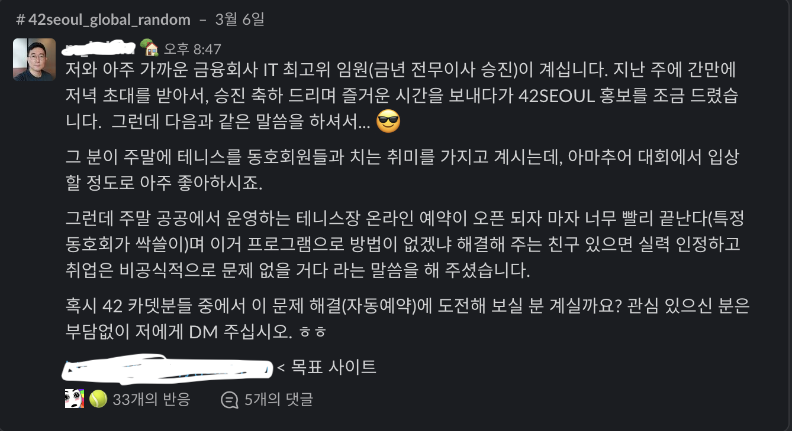
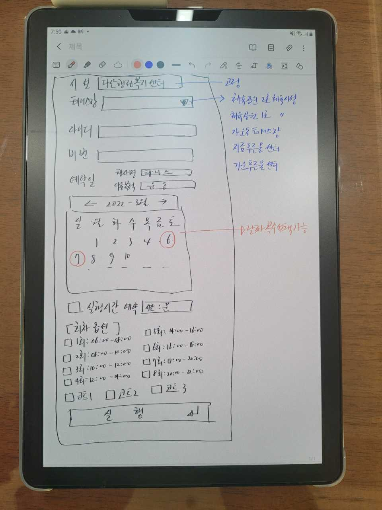
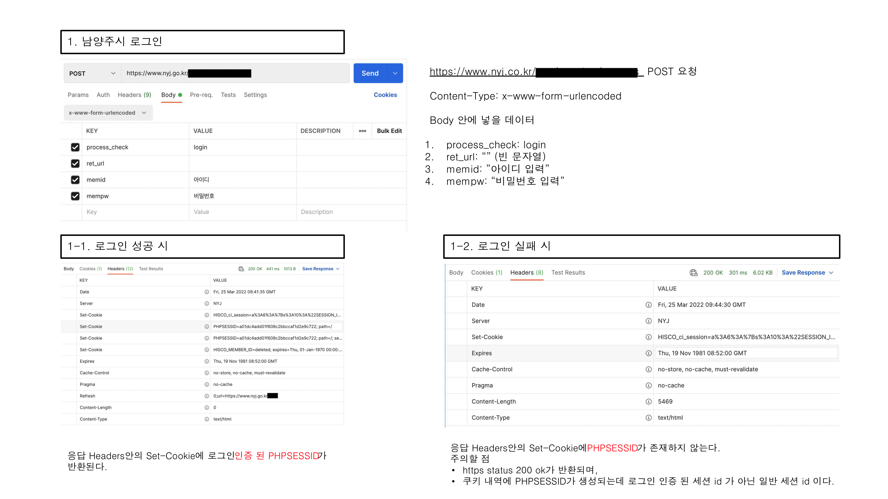
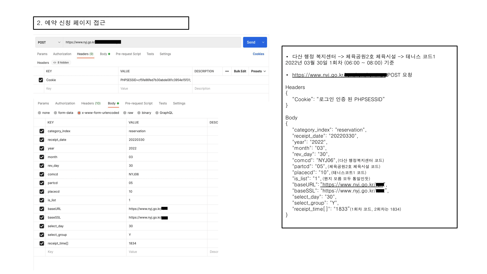
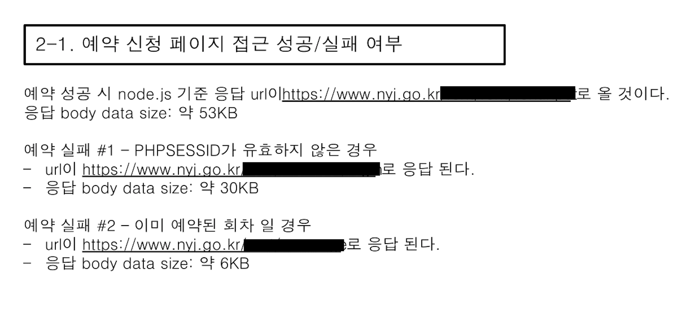
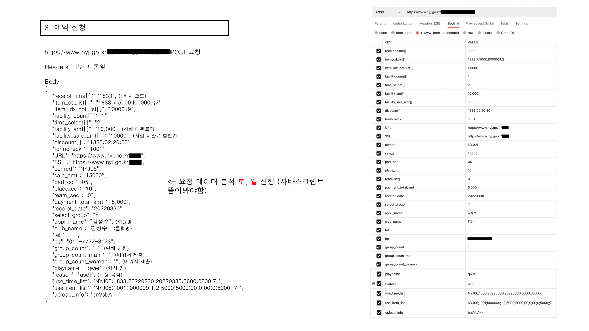
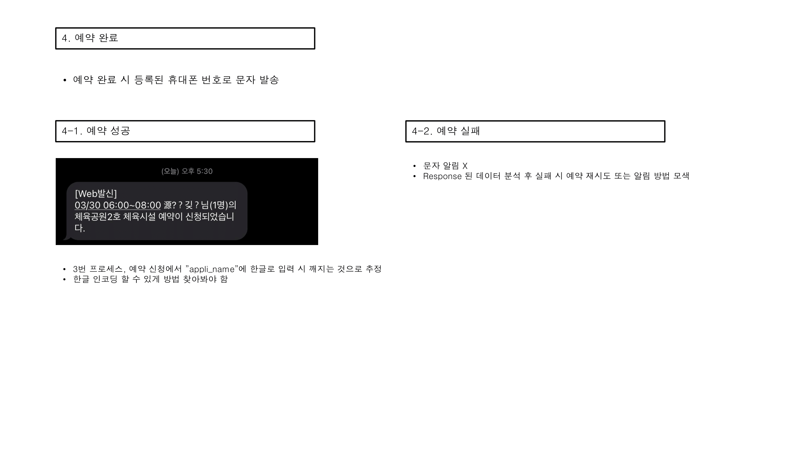
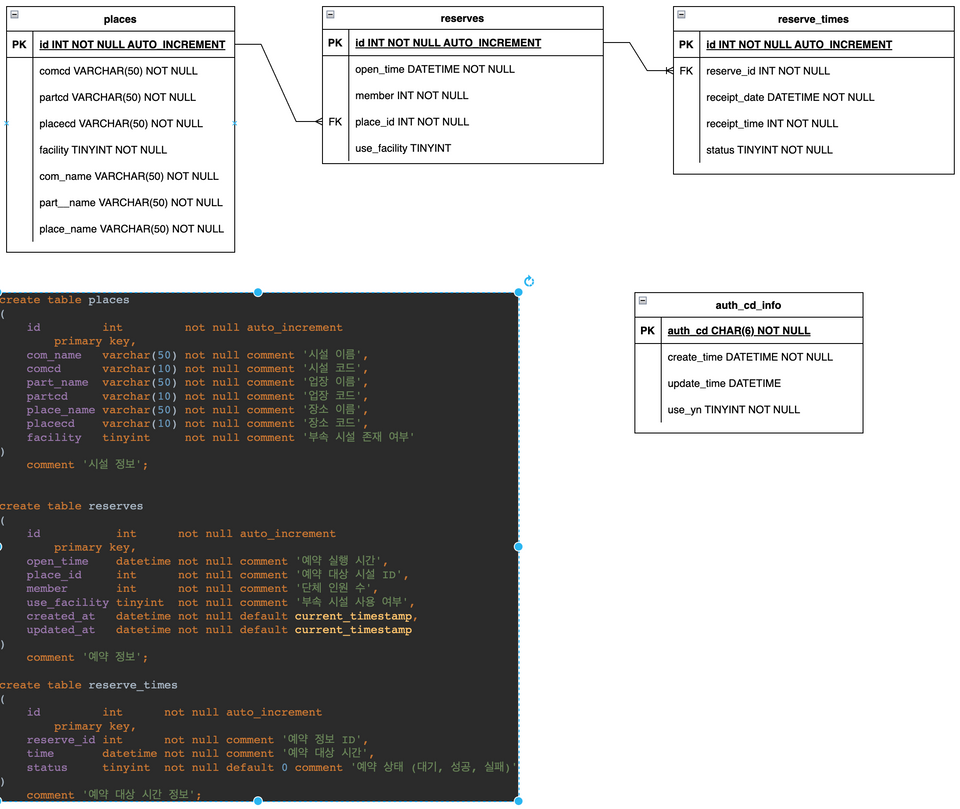
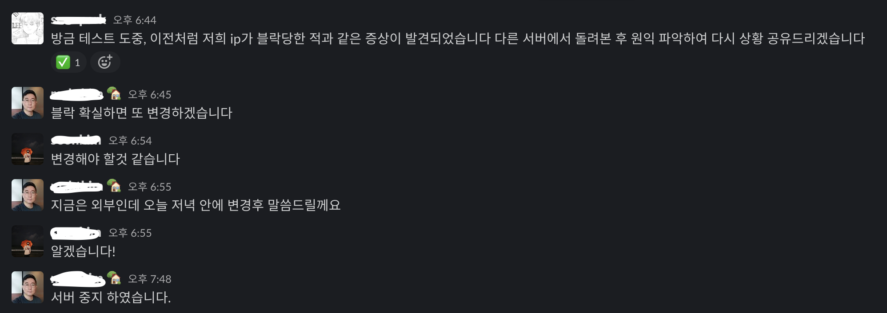

<br>

## 💫 개발하게 된 계기

<br>



아는 멘토님이 외주를 받아오셔서 슬랙에 구인공고를 하시길래, 한번 들여다 보니 `매크로` 서버를 제작해 달라는 것이였다.<br>
오랜기간 프로젝트를 하던 도중이라 힘이 빠져서 기분 전환 겸 새로운 것을 찾고 있었고,<br>
"**취업은 비공식적으로 문제 없을거다**" 라는 멘트에 혹해 지원해서 개발하게 되었지만, 나중에 생각해보니 장난으로 하신 말씀같다.

<br>


> 이렇게 5명의 개발인원 + 리딩해 주시는 멘토님이 만났다.

<br>

### 🤝 첫번째 미팅

<br>


확실히 현업에서 오래 종사하던 분이 리딩을 해주셔서 그런지 기획과 설계의 처리가 남달랐다.<br>
요구사항 명세, 아키텍쳐 설계, 유저 시나리오 등 재직하시며 갖고 계시던 설계 보따리를 풀어 우리에게 제공해주시고, 작성하는 방법을 알려주셨고, 확실한 설계서가 3일만에 만들어 졌다.<br>

<br>

### 📝 요구사항이 들어왔다.

<br>



페이지 구성은 심플했다. 이것만 보고 "**생각보다 얼마 안되겠네ㅋ**"라는 지금와서 돌이켜 보면 미친 생각을 할정도로.<br>

<br>


> 위 요구사항을 바탕으로 제작된 `요구사항 기술서`

<br>

### 😵‍💫 우당탕탕 설계

<br>


매달 말, 다음달 예약 페이지가 열리는데, 그 때 다른 매크로들과 경쟁을 해 예약을 선점 하는것이 우리의 목표였다.<br>
그러기 위해 `Client`에서 지정한 예약 시간에 서버가 작동 되어야 했고, `trigging`이 된 시점엔 예약에 필요한 flow대로 남양주시 예약 프로세스를 잘 처리해야 했다.<br>

<br>

```SHELL
로그인 -> 예약페이지 이동 -> 예약정보 기입 -> 예약 신청
```

그러기 위해선 위와 같은 예약 사이트의 세션을 유지하는 식으로 진행해야 했다.<br>

<br>

## 👣 문제 해결을 위한 접근 방법

<br>


> 예약 프로세스의 간단한 설계도

<br>

일단 미래에 실행될 예약 정보를 `Client`에게 받아오고 DB에 저장한다.<br>
그 뒤 `trigging을 위해` `Linux Cron`을 이용하여 5분 간격으로 데이터베이스를 조회한다.<br>
트리거가 작동되면서 실행시간과 매칭이 되면 예약 사이트에 예약 프로세스를 진행하면 된다.<br>

<br>

### ❓ 프로세스 진행은 어떻게 ❓

<br>

예약을 진행하려면 두가지 방법이 있었다.<br>

<br>

1. 가상 브라우저를 이용한다.
2. 직접 HTTP 통신을 한다.

<br>

처음엔 첫번째 방법으로 진행하려 했다. 두번째 방법으로 하기엔 직접 HTTP 통신을 해서 세션을 유지시켜 본적이 없어 자신이 없었기 때문이다.<br>
하지만 `puppeteer`를 이용해 가상 브라우저로 진행한다면, 각 예약 건수 마다 최소 200MB 이상 메모리를 잡아먹어 리소스 낭비가 너무 심했고, 쓸모없는 html, css, js 파일까지 응답을 받아 속도 측면에서도 굉장히 안좋은 방법이라 분당 10번도 요청을 보낼 수 없었다.<br>

<br>


그리하여 직접 HTTP 통신을 해 예약을 진행하는 방식을 택했다.<br>
그리고 정말 다행히도 옛날 서버라 그런지 소스코드들이 그대로 보여 통신을 분석하기 쉬웠고, 포스트맨을 붙잡고 늘어지며 하루 밤새서 예약 성공을 하게 됐다.<br>

<br>

### 🤔 복잡한 프로세스를 간편화하기 위한 전략

<br>

일단 해당 사이트에서 `Client - Server`간 통신이 어떻게 이뤄지는지 확인해야 했다.<br>
그러기 위해 Ajax요청이 일어나는 부분의 `JavaScript`파일을 계속 들여다 봤고, `x-www-form-urlencoded`라는 `Content-Type`을 사용해 서버에 요청을 하고 세션 기반 사용자 인증이 진행되는 것을 알게 되었다.<br>

<br>

> 지피지기면 백전백승이다.

<br>



우선 세션 id를 발급받기 위해 로그인을 진행했다.<br>
원래는 `세션 id`만 발급받으면 바로 예약 신청이 되는 줄 알았는데, 계속 예약 신청 응답이 실패해서 알아보니, 서버에서 `사용자가 방문한 페이지를 추적`해서, 정상적인 경로로 접근하지 않은 경우 오류를 내는 것이였다.<br>

<br>



여러번의 삽질 결과, 예약 신청 페이지에 방문한 정보를 서버에 기록만 해주면 돼서, 예약 신청 페이지 접근을 위한 http 통신을 한번 더 진행하게 됐다.<br>

<br>



위 예약 신청 페이지에 대한 응답인데, 아마 `기존 등록된 예약에 대해 예약 신청`을 하는 등 예외처리를 위해 페이지 `Trace를 추적`하는 것으로 판단된다.<br>

<br>



예약 신청을 하기 위한 모든 절차가 끝났으니, 이제 예약을 진행하면 된다.<br>
예약에 필요한 사용자 정보를 적절히 기입하면 예약이 성공하는데, 굉장히 많은 정보를 입력해야 한다.<br>
직접 남양주시 예약 사이트에 방문해도 알 수 있지만, "**하나의 예약 신청**"을 위한 `Deps`가 엄청나고, 많은 데이터가 필요하다.<br>

> 사실 이런 복잡함을 해결하고자 서비스를 제작하게 됐다.

<br>



정상적으로 예약이 됐다면, 휴대폰 문자로 알림이 갈 것이고<br>
실패했다면, `트랜잭션 재시도`를 시도하게 했다.<br>

> 그래도 지속적으로 실패한다면 5분 뒤 `예약 실패`로 DB에 기록된다.

<br>

## 🧑‍💻 개발 방법

<br>


특정 시간에 N개의 예약 건수가 있을 수 있으니, 비동기를 이용한 병렬 처리를 위해 Node.js를 사용하였다.<br>
N개의 예약들을 `타겟이 되는 날짜를 기준으로 트랜잭션`으로 묶었고,<br>
각 트랜잭션마다 예약을 초당 2번씩 `분당 120번 * 5분 * m개` 예약 사이트에 요청을 보냈다.<br>
그 중 성공/실패로 `모든 프로세스가 끝난 트랜잭션`은 더이상 요청을 보내지 않도록 처리를 중지시켰고, 끝나지 않은 예약 건수들은 5분이 될 때 까지 계속 진행된다.<br>

<br>

> m개인 이유 -> 하루에 총 8개의 예약이 가능해서 m개이다.

<br>

### 🎾 트리거 작동 방법

<br>

```TS
try {
        await sequelize.sync({ force: false });
        console.log("🚀 Database connect successfully.");
        console.log(`Executor starts at ${new Date().toLocaleString()}`);

        const reserves = await Reserve.findAll();

        reserves.map((value) => {
            const now = new Date();
            const open = new Date(value.open_time);

            if (value.status !== 1 && value.status !== 3 && open <= now && now <= new Date(Date.parse(open) + 5 * 60 * 1000)) {
                const executeOptions = {
                    method: "GET",
                    headers: { cookie: `access=${JWT.accessSign()}; refresh=${JWT.refreshSign()};` },
                    url: `${process.env.API_ENDPOINT}/rent/execute/${value.id}`,
                };

                axios(executeOptions).catch((err) => console.log(err));
            }
        });
    } catch (err) {
        console.log(err);
    }
```

<br>

`Linux Cron`을 이용해 위 코드를 5분에 한 번 실행시킨다.<br>
일단 DB에서 미래의 예약 정보를 모두 불러온다.<br>
그 뒤, `예약 성공`, `예약 대기`, `예약 실패` 상태 중 `예약 대기`이며, `Client`가 작동하게 설정한 시간이 되면, 동작중인 예약 프로세스 서버에 예약 정보를 건네주고 예약이 진행된다.<br>

<br>

만약 위 코드에서 `throw` 된다면, 실패 시 찍히는 `console.log`를 따로 저장해서, 어떤 경우에서 실패하는지 모니터링을 하였다.<br>

<br>

## 📑 프로젝트 설계도

<br>

멘토님이 프로젝트 리딩을 해주셔서 토이 프로젝트 치고 꽤 괜찮은 설계들이 나왔다.<br>

<br>


> 사용자 예상 시나리오

<br>


> Data Flow Diagram

<br>



> Database ERD

<br>

확실히 시니어가 참여한 프로젝트와 학생끼리 진행하는 프로젝트의 질은 기간을 떠나서 확연한 차이가 나는것 같다.<br>

<br>

## 😁 후기

<br>



사실 결과적으로 실패한 프로젝트여서 마무리가 너무 아쉬웠던 프로젝트이다.<br>
예약 사이트의 `IP 차단 로직`이 들어가 있었는데 이 부분에 대해 대응을 전혀 하지 않았기 때문이다.<br>
지속적인 IP 차단으로 인해 정상적인 서버 운영이 힘들었고, 동적 IP를 할당하여 지속적으로 변경해줘도 막히면 다시 IP를 할당하는데 시간이 걸렸기 때문이다.<br>

<br>

그래서 동적 IP 풀을 구성해서 `IP 차단 응답`이 오거나 `timeout`이 될 때 IP를 변경해준 뒤, 매일 00시 IP 풀을 한번 초기화 해주는 방법을 시도하려 했지만, 아쉽게도 프로젝트는 마무리 되었다.<br>

<br>

## ❗️ 그래서 뭘 배웠냐 ❗️

<br>

이 프로젝트를 진행하며, 특정 사이트의 `세션 유지 방법`을 알게 되었고, HTTP 통신을 더 뜯어본 계기가 되었다.<br>
또한, 가상 브라우저 없이 단순 요청/응답 만으로 원하는 결과를 얻는, 즉 `리소스를 최소한으로 소모`하며 통신을 하는 방법을 깨달았다.<br>
이런 경험을 통해 `문제 해결력`을 키우고 `여러 방면으로 사고`를 할 수 있는 개발자가 되어가고 있는 것 같다.<br>

<br>

## 📚 Github 주소

<br/>

> https://github.com/KOREAparksh/TennisKing

<br/>
<br/>

```toc

```
