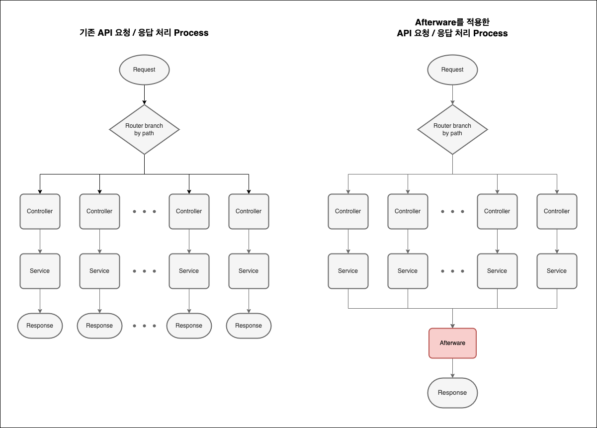

오늘은 생소하고 아무도 사용 안하는 `Afterware` 개념을 도입해 모든 API 응답에 JWT가 만료되었다면 새로 발행해주는 코드 짜고자 한다.<br/>
원래 Express에 `Middleware` 개념이 있고 실제로 지원이 된다.<br/>
하지만 현재 구현하는 로직 상 `Afterware`를 사용하면 유지보수에 상당히 도움이 될 것 같다<br/>

<br/>

## 🤔 Afterware 란?

<br/>

사실 Express 프레임워크에 `Afterware`란 기능은 없다<br/>
그냥 맨 마지막에 실행되는 함수라 이렇게 부르는 것일 뿐이다<br/>
`Middleware`가 요청 - 응답 사이에 엑세스 권한을 갖는 함수라면<br/>
`Afterware`는 어플리케이션의 모든 프로세스가 끝난 뒤 응답 직전에 실행되는 함수이다<br/>

<br/>



> Afterware 이해를 돕기 위한 그림

<br/>

왼쪽은 일반적인 Express Process이다. 이 경우에 Express 디자인 패턴이 적용 돼<br/>
`Router` -> `Controller` -> `Service` 순으로 실행이 되며 Service가 실행된 뒤 바로 Client에 요청한 데이터를 응답 해준다.<br/>
그리고 오른쪽 프로세스 처럼 `Afterware`를 적용했을 때 Service가 끝이나면 `Afterware`함수를 거쳐 응답이 된다.<br/>

<br/>

## 🎓 사용하는 이유

<br/>

현재 모든 데이터 요청마다 Access, Refresh Token을 받아와 검증을 진행하는데 만약 Access Token 이 만료되었다면 `데이터 요청(Token 만료)` -> `Access Token 재발급` -> `데이터 요청` 처럼 총 3번의 API 요청이 있게 된다.<br/>
이렇게 요청의 횟수가 늘어나면 그만큼 리소스 소모가 심해져 성능상 문제가 생길 수 있다.<br/>

<br/>

이런 형식에서 탈피하고자 원래는 데이터 요청에 Access Token이 만료 되었다면 `Service`단이 끝날 때 Access Token을 재발행 해 응답값에 같이 넣어주는 로직을 짜려했는데, 모든 함수마다 다 추가를 해야했다.<br/>
그런 불편함을 느끼던 중 깔때기에 아이디어를 얻어 실행중인 모든 로직의 마지막을 한 함수로 모아 응답을 시켜주면 좋겠다 생각을 해 사용하게 되었다.<br/>

<br/>

### 👍 장점

- 모든 응답이 깔때기처럼 한곳으로 모여 처리가 돼 유지보수가 쉽다.
- 위 이유로 JWT 재발급을 쉽게 처리 할 수 있다.
- Node.js는 싱글 스레드라 에러가 나면 서버가 다운되는데, `Afterware`를 도입한다면 어디에서 오류가 터지던 예상치 못한 에러 핸들링이 가능하다.

<br/>

> 이부분은 [Express 에러 핸들링](https://seongsu.me/express-error-middleware)를 참고하자

<br/>

### 👎 단점

- 아무 레퍼런스가 없어 직접 구현해야한다. (진짜 하나도 없고 개념도 생소하다)
- 아무래도 틀이 정해져 있다 보니 한정적으로 사용할 수 밖에 없다.
- 개발하면서 이게 맞나? 싶다

<br/>

## 🚀 적용해 보기

<br/>

`modules/afterware.ts`

```TS
import { Request, Response, NextFunction } from "express";

const afterware = (fn: Function) => (req: Request, res: Response, next: NextFunction) => {
    Promise.resolve(fn(req, res, next))
        .then((body) => {
            res.json(body).status(200);
        })
        .catch((err) => next(err));
}
```

> 임시로 짜여진 Afterware 코드이다

<br/>

일단 `Promise.resolve`로 내부 function을 감싸준다.<br/>

> 내부 function은 controller 함수이다.

controller단에서 정상적으로 종료되고 body값을 리턴해 준다면 그대로 Response를 해준다.<br/>
만약 controller단에서 오류가 났다면 catch문으로 코드가 흐를 것이고 `next(err)` 함수가 실행이 돼 `Error Middleware` 로 넘어간다.

<br/>

`routes/users.ts`

```TS
import { Router } from "express";
import { getUser } from "@controllers/user/info";
import afterware from "@modules/afterware";
import jwtVeriry from "@modules/auth";

const router: Router = Router();

router.get("/users/:userId", jwtVerify, afterware(getUser));
```

<br/>

` http://localhost:5000/users/123` 주소로 API 요청이 들어왔다고 가정해 보자.<br/>
위 코드에서 **jetVerify** 미들웨어에서 문제가 없다면, **getUser** 함수가 호출될 것이다.<br/>
그 뒤 **getUser** 내부 로직이 모두 실행 된 뒤 **getUser**를 감싸고 있는 `afterware` 함수가 실행이 돼 **getUser**에서 return 된 데이터를 Response 해줄 것이다.<br/>

<br/>

내가 여기서 만드려고 하는 부분은 **jwtVerify**에서 Token 위변조가 안되었고 DB에 저장되어있는 Refresh Token 검증도 성공했으며 오직 Access Token이 만료 되었다는 신호가 왔을 때 만료되었다는 응답을 보내는것이 아닌, `afterware` 함수에서 새로 Access, Refresh를 발급해 주는 코드를 짜려 한다.<br/>

<br/>

위 장점에도 서술했지만 이런 방식을 선택했을 때 예상치 못한 에러 처리에 대한 부담감도 덜 수 있고 모든 응답 Process를 획일적으로 관리 해 유지보수를 보다 쉽게 하려 한다.<br/>

```toc

```

<br/>
<br/>
