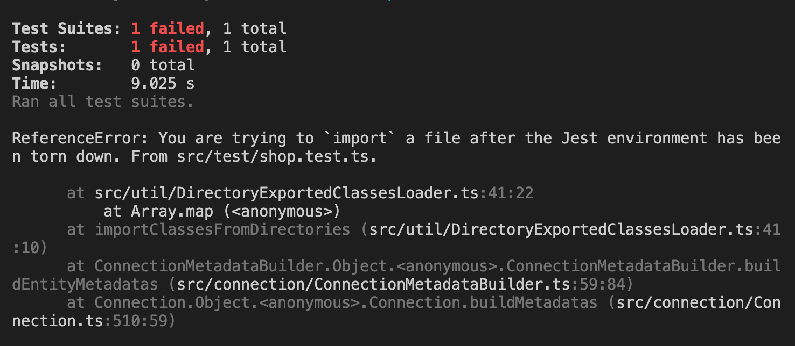
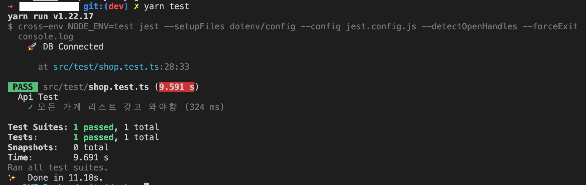

<br/>

개발이 어느정도 진행되고, API 서버가 정상 작동하는지 포스트맨으로 일일히 확인해봤다.<br/>
하지만 `MVP` 단계이긴 하지만 규모가 점차 커질수록 기능이 많아져 수작업으로 테스트를 하는게 불안해지기 시작했다. 그래서 `Jest`를 이용한 단위 테스트로 TDD를 적용해 보고자 포스팅을 하게 되었다.<br/>

<br/>

## 👠 Jest 란

<br/>

`Jest`는 코드가 정상적으로 동작하는 지 확인하는 테스트 케이스를 만들어<br/>
정해놓은 `Expected`값과 반환되는 `Received`값을 비교해 코드의 상태를 확인해주는 프레임워크 이다.<br/>

<br/>
<br/>

## ❓ Jest를 사용하는 이유

<br/>

`lint`가 코드 스타일에 규칙을 정하는 것이라면 코드가 올바른 기능을 하는 지 체크 할 수 있다.<br/>
이를 통해 보다 안정적이고 제대로 동작하는 코드를 작성할 수 있다.<br/>

<br/>
<br/>

## 🛠 Jest 설정하기

<br/>

현재 개발 환경이 `TypeScript`이므로 `ts-jest`, `@types/~` 관련 모듈도 설치해 준다.<br/>
그리고 `supertest`는 `request`통신을 만들어 주는 역할을 하니 `express` 테스트를 위해 필요하므로 같이 설치해 준다.<br/>

```Shell
npm insatll --save-dev @types/jest @types/supertest jest ts-jest supertest
또는
yarn add --dev @types/jest @types/supertest jest ts-jest supertest
```

<br/>

그 뒤 script 설정과 jest 설정을 따로 해줘야 한다.<br/>

<br/>

`package.json`

```JSON
{
    "scripts": {
        "test": "cross-env NODE_ENV=test jest --setupFiles dotenv/config --config jest.config.js --detectOpenHandles --forceExit"
    },
}
```

<br/>

test 환경으로 핸들링 하기 위해 `NODE_ENV`를 test로 설정 한다.<br/>
env파일로 환경변수를 관리한다면 `--setupFiles dotenv/config` 꼭 넣어야 jest에서 환경변수를 사용할 수 있다.<br/>
`Node.js`에서 실행이 모두 완료 되어도 비동기가 남아있는 경우 jest가 종료되지 않는데 `detectOpenHandles` 옵션으로 열려있는 핸들링 을 모두 수집하고 `forceExit` 옵션으로 테스트 후 종료시켜 준다.<br/>

<br/>

`jest.config.js`

```JS
module.exports = {
    preset: "ts-jest",
    moduleNameMapper: {
        "@routes/(.*)$": "<rootDir>/src/routes/$1",
        "@controllers/(.*)$": "<rootDir>/src/controllers/$1",
        "@services/(.*)$": "<rootDir>/src/services/$1",
        "@repository/(.*)$": "<rootDir>/src/repository/$1",
        "@entities/(.*)$": "<rootDir>/src/entities/$1",
        "@modules/(.*)$": "<rootDir>/src/modules/$1",
    },
};
```

<br/>

`TypeScript` 환경에서 jest를 사용한다면 preset에 `ts-jest`를 명시해줘야 한다.<br/>
`moduleNameMapper`는 타입스크립트 환경에서 `Path Alias`를 사용하는 경우 꼭 설정해 줘야 테스트 할 때 경로를 알아서 찾는다.<br/>

<br/>

이로써 `Jest` 기본 설정은 끝이다.<br/>

<br/>
<br/>

## 🛫 실제 테스트

<br/>

`내가 지정한 경로`

```Plain
├── src             # 소스 폴더
    ├── modules         # 사용자 지정 모듈
    ├── routes          # 요청에 따른 분리
    ├── controllers     # API 요청/응답 실행
    ├── services        # 데이터 가공
    ├── repository      # DB CRUD
    ├── entities        # Model과 동일
    └── test            # Jest 테스팅 폴더, 이곳에 테스트 파일들이 모두 담긴다.
```

<br/>

테스트를 하기위해 테스트 파일을 작성해야 하는데 아무 경로에 `원하는이름.test.ts` 이렇게 명시해주면 jest가 알아서 찾아 테스팅을 하게 된다.<br/>

> ex) 유저 테스트를 하는 경우 user.test.ts 또는 user.spec.ts

<br/>

### 🎓 Jest 기본 규칙

<br/>

`describe` : 여러개의 테스트 케이스를 묶어 가독성을 높인다.<br/>
`test/it` : 테스트 단위<br/>

<br/>

**Methods LIST** : 전역에 쓰면 모든 테스트가 적용되고 묶은 describe 속에 넣으면 그 속에 있는 test에만 methods가 적용된다.<br/>

- `afterAll(fn, timeout)` : 모든 테스트가 끝나고 실행된다<br/>
- `afterEach(fn, timeout)` : 하나의 테스트가 끝날 때마다 실행된다<br/>
- `beforeAll(fn, timeout)` : 모든 테스트가 시작하기 전에 한번 실행된다.<br/>
- `beforeEach(fn, timeout)` : 하나의 테스트가 시작하기 전에 매번 실행한다<br/>

<br/>

`예시`

```TS
describe('테스트 단위', () => {
    beforeAll(() => {
        /* 모든 test() 함수 실행 이전에 작동한다. */
    });

    afterAll(() => {
        /* test() 함수가 모두 실행된 이후에 작동한다. */
    });

    test('무슨 테스트인지 여기에 작성한다.', () => {
        ...
    });
});
```

> **describe** 단위로 여러 테스트를 진행하면 관리하기 용이하다.

<br/>

### 🎬 Jest를 이용한 테스트

<br/>

`app.ts`

```TS
if (env.nodeEnv !== "test") {
    createConnection()
        .then(() => console.log("🚀 DB Connected"))
        .catch((err) => console.log(err));
}
```

<br/>

`app.ts`에서 DB 연결을 시도하면 테스팅이 끝날때 까지 `Typeorm connection` 이 끝나지 않아서 오류가 발생한다.<br/>

> app.ts에 비동기 방식으로 짜여진 핵심 코드가 더 있다면 오류 날 확률이 생길 것이다.

그래서 `NODE_ENV !== "test"` 인 경우만 `app.ts`에서 DB 연결을 시도하고 테스팅 환경에선 테스트 파일에서 따로 DB 연결을 시도해 준다.<br/>

<br/>



> app.ts에서 DB 연결을 시도한 경우 import error가 뜬다.

<br/>
<br/>

`src/test/shop.test.ts`

```TS
import request from "supertest";
import { createConnection } from "typeorm";
import app from "../app";

describe("Api Test", () => {
    beforeAll(async () => {
        await createConnection()
            .then(() => console.log("🚀 DB Connected"))
            .catch((err) => console.log(err));
    });

    test("모든 가게 리스트 갖고 와야함", async () => {
        const response = await request(app).get("/v0/shops");

        // expect에 예상 값을, toBe에 결과 값을 넣는다.
        expect(response.status).toBe(200);
    });
}
```

<br/>

위 코드는 Jest Tester가 `/v0/shops` URL에 `GET`요청을 보낸 후 예상 값과 결과 값을 비교 해 결과를 반환해준다.<br/>

<br/>



<br/>

현재 프로젝트에서 위 URL로 `GET` 요청을 보내면 DB에서 모든 가게 리스트를 조회 해<br/>
성공 시 `Http Status Code - 200 OK` 응답을 보내준다.<br/>
위 코드에서 결과 값 200과 응답 값(예상 값)이 200으로 동일해 테스트 성공이라는 결과가 나왔다.<br/>

<br/>

이런식으로 단위 테스트를 진행하면 되고 나중엔 통합 테스트, 부하 테스트를 공부한 뒤 포스팅 해야겠다.<br/>

<br/>
<br/>

## 📚 참고 자료

<br/>

> Configuring Jest

- https://jestjs.io/docs/configuration

<br/>

> TypeScript Express에서 세팅하는 JEST

- https://velog.io/@cloudjun/Node-TypeScript-Express%EC%97%90%EC%84%9C-%EC%84%B8%ED%8C%85%ED%95%98%EB%8A%94-JEST

<br/>

> Jest ORM Error 해결법

- https://velog.io/@hyex/moogosejest-ReferenceError-You-are-trying-to-import-a-file-after-the-Jest-environment-has-been-torn-down

<br/>
<br/>

```toc

```
