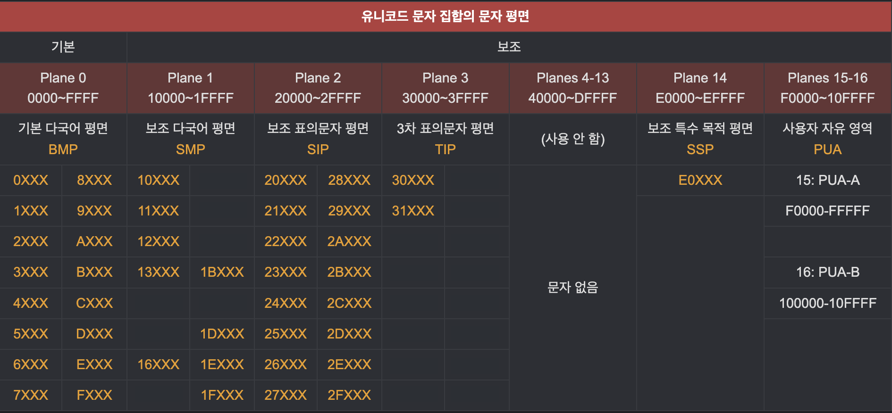
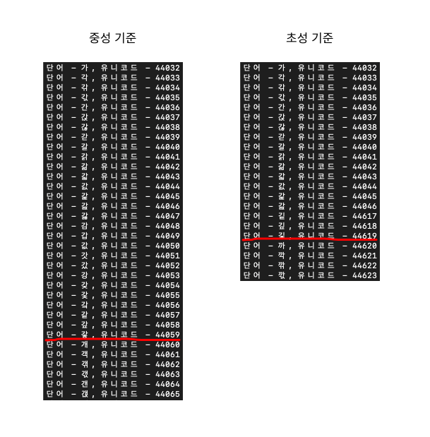
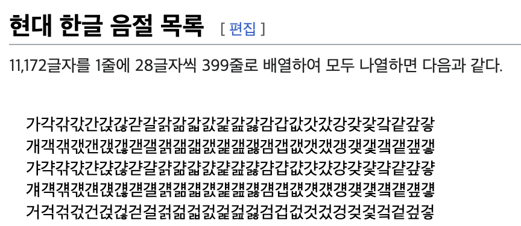

<br>

## 🤖 자연어 처리(NLP) 란

<br>

인간의 언어 현상을 컴퓨터와 같은 기계를 이용해서 묘사할 수 있도록 연구하고 이를 구현하는 인공지능의 주요 분야 중 하나다. 자연 언어 처리는 연구 대상이 언어 이기 때문에 당연하게도 언어 자체를 연구하는 언어학과 언어 현상의 내적 기재를 탐구하는 언어 인지 과학과 연관이 깊다. 구현을 위해 수학적 통계적 도구를 많이 활용하며 특히 기계학습 도구를 많이 사용하는 대표적인 분야이다. 정보검색, QA 시스템, 문서 자동 분류, 신문기사 클러스터링, 대화형 Agent 등 다양한 응용이 이루어지고 있다.

> [출처] [Wikipedia](https://ko.wikipedia.org/wiki/%EC%9E%90%EC%97%B0%EC%96%B4_%EC%B2%98%EB%A6%AC)

<br>

쉽게 설명하자면, 인간이 일상에서 사용하는 언어를 컴퓨터에서도 자연스럽게 묘사할 수 있게 만드는 기술이다.<br>

<br>

하지만 꼭 `자연어 처리`만으로 컴퓨터에서 자연어를 나타낼 수 있는것이 아니라 `Human Intelligence`를 통해서도 자연어를 구현할 수 있다.<br>

> 우리 개발자님이 마법을 부려 주실거야

<br>

### 🤔 AI 기술 없이 문장화가 가능할까?

<br>

한글이 웹 상에서 보여지는 것에도 공통된 `Protocol`이 있기 때문이다.<br>

<br>

이런 `Protocol`을 이용하면 한글이 저장된 방식을 이해할 수 있고, 그에 맞게 단어 간 초성, 중성, 종성을 비교 후 `조사`, `종결 어미`를 추가해 문장화를 구현할 수 있을 것이다.<br>

<br>

### 🚏 표준 문자 처리 방식, Unicode

<br>



> [출처] [유니코드 문자 규칙](https://namu.wiki/w/%EC%9C%A0%EB%8B%88%EC%BD%94%EB%93%9C#s-4.1)

<br>

유니코드 컨소시엄(Unicode Consortium)에서 제정, 관리하는 `Unicode`는 세계의 모든 문자를 다루도록 설계된 표준 문자 전산 처리 방식이다.<br>

<br>

```
초창기에는 문자 코드는 ASCII의 로마자 위주 코드였고, 1바이트의 남은 공간에 각 나라가 자국 문자를 할당하였다.
하지만 이런 상황에서 다른 국가에 이메일을 보냈더니 글자가 와장창 깨졌던 것.
인터넷 웹페이지도 마찬가지였다.
이에 따라 4바이트(32비트, 약 42억 자)의 넉넉한 공간에 세상의 모든 문자를 할당한 결과물이 이것이다.

현재의 유니코드는 지구상에서 통용되는 대부분의 문자들을 담고 있다.
여기에는 언어를 표기할 때 쓰는 문자는 물론, 악보 기호, 이모지, 태그, 마작이나 도미노 기호 같은 것들도 포함된다.
```

> [출처] [유니코드 개요](https://namu.wiki/w/%EC%9C%A0%EB%8B%88%EC%BD%94%EB%93%9C#s-1)

<br>

이런 방식으로 한글도 문자 전산 처리 규칙에 따라 처리되고 있으며<br>
1991년 유니코드에 한글이 최초로 등록되었고, 이후 수정과 수정을 거쳐 현재 4,306개의 한글 문자가 등록되어 있다.<br>

<br>

## 🤩 Unicode를 이용한 단어간 문장화

<br>

유니코드를 통해 한글 글자에 맞게 저해진 규칙이 있으니, 이 것을 파헤쳐 보며, 문장화를 구현해 보면 될 것이다.<br>
그러기 위해 `JavaScript`를 이용하여 문장화를 구현할 것이고, 다행히도 `JavaScript String` 내부 함수로 `charCodeAt()`라는 문자열을 유니코드로 변환시켜주는 함수가 존재했다.<br>

<br>

### 1️⃣ charCodeAt()

<br>

```JS
console.log("가".charCodeAt(0));

> 44032
```

<br>

"**가**"에 대한 유니코드 분석을 위해 `charCodeAt()`함수에 문자열의 0번째 인덱스를 집어넣어 보니 `44032`라는 응답값이 나왔다.<br>

<br>

그럼 "**ㄱ**"과 "**ㅏ**"가 합쳐진 값이 `44032`일까?

<br>

```JS
console.log("ㄱ".charCodeAt(0));
console.log("ㅏ".charCodeAt(0));

> 12593
> 12623
```

> 엥.. 아니네?

<br>

이런 결과로 "**ㄱ**", "**ㅏ**", "**가**"는 유니코드 상 다른 위치에 저장되어 있다는 것을 알 수 있고, 모음과 자음으로 모든 경우의 수로 나타낼 수 있는 `하나의 단어가` 유니코드에 총 4,306개로 저장되어 있는 것을 추측할 수 있다.<br>

<br>

### 2️⃣ 유니코드에 초성, 중성, 종성이 저장된 규칙

<br>

일단 "**ㄱ**"부터 저장되어있는 한국어의 모든 유니코드를 순회하며 규칙을 찾아볼 예정이다.<br>

<br>

```JS
const start = 12593;  // "ㄱ".charCodeAt(0)

[...new Array(100)].map((val, idx) => {
  const word = String.fromCharCode(start + idx);

  console.log(`단어 - ${word}, 유니코드 - ${start}`);
});
```

<br>


위 코드를 실행하면 자음과 모음의 유니코드를 알 수 있다.<br>
이렇게 "**가**"부터 "**힣**"까지 돌려보면 초성, 중성, 종성이 몇개의 규칙에 따라 바뀌는 지 알 수 있을 것이다.

<br>



종성은 1개, 중성은 28개, 초성은 588개마다 변하는 것을 알 수 있다.<br>

<br>

### 3️⃣ 종성에 들어오는 자음을 알 수 있는 법

<br>



> [출처] [Wikipedia](https://ko.wikipedia.org/wiki/%ED%95%9C%EA%B8%80_%EC%9D%8C%EC%A0%88)

<br>

위 사진과 같이 한글 **한 단어**의 종성에 들어올 수 있는 자음의 개수는 27개 이고, 자음이 들어오지 않는 단어는 1개로 같은 초성, 중성에서 종성의 경우의 수는 28이다.<br>

<br>

이런 규칙을 통해 종성의 유무를 판단할 수 있고, 조사를 붙일지 말 지 결정할 수 있다.<br>

<br>

### 4️⃣ 두 단어간 문장화

<br>

```JS
const first = "성수";
const second = "사랑했다";

const postposition = (Math.floor((first.charCodeAt(first.length - 1) - 44032) % 28) > 0);

console.log(`${first}${postposition ? "을" : "를"} ${second}`);


> 성수를 사랑했다
```

> 참 감성적인 문장이 탄생했다.

<br>

앞에서 알아본 `음절의 규칙`에 따라 단어의 마지막 글자에 "**가**"의 유니코드인 `44032`를 뺀뒤, 중성의 개수 28을 나눈 나머지를 계산하면, 현재 단어에 종성이 붙어있는지 확인할 수 있다.<br>

> 44032를 빼 "**가**"를 0으로 지정한 이유는 28로 나눈 나머지를 편하게 확인하기 위해서이다. (사실 안빼고 계산해도 됨)

> 0 이면 종성이 없는 것, 1 이상이면 종성이 있는 것이다.

<br>

이러한 방식을 통해 단어의 종성 유무를 판단하고, 그에 맞는 조사를 붙여주면 단어 간 문장화가 완료된다.<br>

<br>

## 🗣 후기

<br>

알고나면 어려운 구현사항은 아니였지만, 유니코드의 한글 저장 규칙과 한글의 음절 규칙 등 방법을 알기위해 노가다가 필요했다.<br>

> 한글 규칙은 학교다닐 때 공부 열심히 했더라면 좀 더 쉽게 알았을 듯 하다.

<br>

이처럼 유니코드에 정해져 있는 한글 규칙을 잘 알아보고, 그에 맞게 활용하면 위 코드보다 더 좋은 구현을 할 수 있을 것 같다.<br>

<br>

## 📚 참고 자료

> NLP

- https://ko.wikipedia.org/wiki/%EC%9E%90%EC%97%B0%EC%96%B4_%EC%B2%98%EB%A6%AC

<br>

> Unicode

- https://namu.wiki/w/%EC%9C%A0%EB%8B%88%EC%BD%94%EB%93%9C

<br>
<br>

```toc

```
