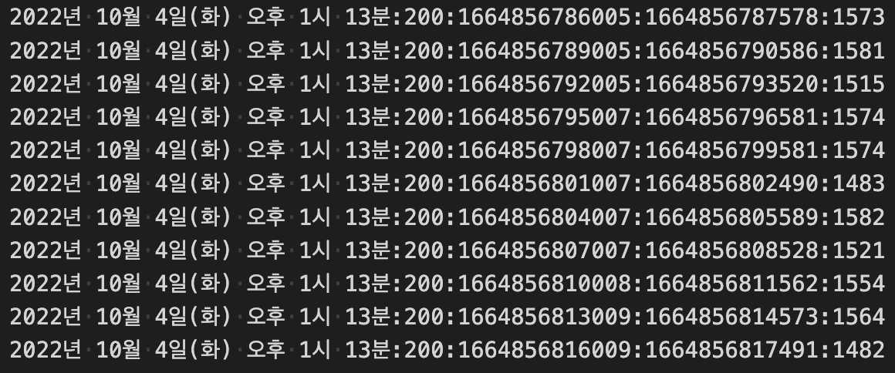
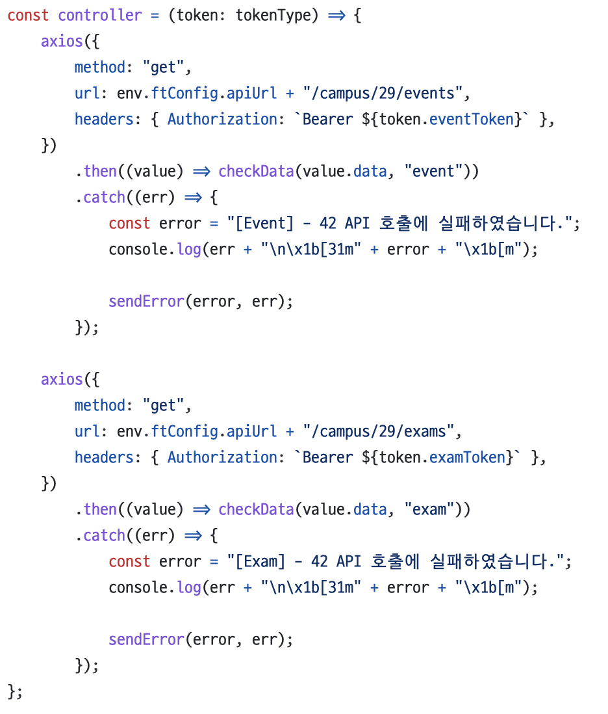
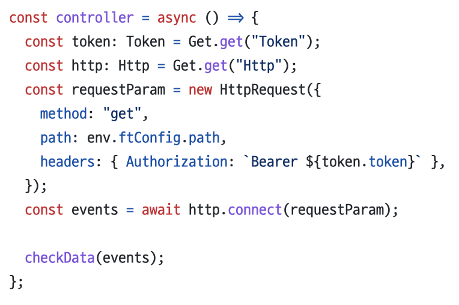

<br>

## 🐽 개요

<br>

프랑스에서 3초마다 데이터를 받아와 Slack으로 최신 데이터를 제공해주는 서비스를 운영중인데, 평균 2-3초의 `Latency`가 있었다.<br>

<br>

```
프랑스 API 서버 -> AWS Seoul Region -> 데이터 가공 -> Slack
```

<br>

위와 같은 Flow로 데이터가 이동하였는데 아무리 프랑스에서 데이터가 전송된다 해도, 말이 평균이지 최소 2초의 지연시간은 발생하였다.<br>

> 10초가 넘어가는 경우도 가끔 있었다.

이렇게 불안정한 환경으로 서버를 운영하는 것은 서비스 질적으로 최악이라 판단해서 서버 운영 1주년을 기념해 `서버 최적화`를 기획하게 되었다.<br>

<br>

## 🎨 최적화 방법을 떠올려 보자

<br>

일단 데이터 Flow를 기준으로 `프랑스에서 데이터를 받아오는 부분`, `데이터 가공하는 부분`, `데이터를 Slack으로 전송하는 부분` 총 3가지를 트랜잭션으로 묶었고, 로깅을 진행했다.<br>

<br>

### 📄 범인은 API 응답이 늦어서 였다.

<br>



프랑스에서 한국까지 API를 받아오는데 `평균 1,550ms` 정도를 기록했고, 데이터 가공은 `평균 200ms` 미만, slack 전송은 `평균 300ms` 정도였다.<br>

<br>

### 🤟🏻 Latency를 줄이기 위한 방법

<br>

`Latency`를 줄이겠다고 서버 데이터 가공 로직을 최적화 하는건 한계가 있을 것이다.<br>
그래서 최적화는 그대로 하되, 데이터를 받아오는 지역 자체를 프랑스로 옮기고, 데이터가 한국으로 전달되는 부분은 Slack의 데이터 전송 기술을 믿으면 더 효율적인 최적화 방법이 될 것 같았다.<br>

<br>


그러기 위해 일단 `AWS Region`을 Paris로 옮겼는데, 어머나.. `Latency`가 1/10 이상 줄어들었다.<br>

<br>

사실 이렇게 많이 줄어들 줄 몰랐는데, 프랑스에서 한국까지 데이터가 전송되는데 많은 `Router`를 거치며 지연시간이 늘어났나 보다.<br>

<br>

여기에 데이터 가공 로직까지 최적화 한다면, 유의미한 결과가 나올 것 같았다.<br>
원래는 `Event`, `Exam`으로 나눠진 두개의 데이터를 하나의 프로세스에서 비동기로 처리하고 있었다.<br>
이 두개를 각 프로세스에서 돌릴수 있게 `Interface 코드`를 짜고, 환경변수로 `Event`, `Exam` 프로세스를 분리했다. 그 뒤, Webpack을 이용해 `Interface 코드`를 번들링 하였고 각 프로세스를 실행시켰다.<br>

<br>



> 최적화 전 코드

<br>



> 최적화 후 코드

<br>

두 코드를 보았을 때, `선언형`, `추상화`에 초점을 맞춰 리팩토링을 진행하니 확실히 코드의 가독성이 좋아졌다.<br>
Node.js의 `모듈 캐싱 전략`을 적절히 활용하여 `DI`를 적용한 것도 가독성에 한몫 했다고 보이는 것 같다.<br>

<br>

### ☂️ 대기업 플랫폼을 이용한 최적화 전략.. 먹혔나?

<br>


> Paris Region 서버 Slack 응답 로그

<br>


> Seoul Region 서버 Slack 응답 로그

<br>

결과를 보니 확연한 차이가 있었다. Paris로 Region을 이전한 것, 서버 프로세스 최적화를 진행한 것 이 두개의 효율이 잘 나와 `700ms의 Latency`를 줄이게 되었다.<br>

<br>

## 🐍 뱀의 머리보단 용의 꼬리가 낫다

<br>

확실히 직접 통신 비용을 줄이려는 노력을 하기보단, 이미 구축되어있는 플랫폼의 기술을 이용하는 것이 좋은 방법인 듯 하다.<br>
이로써 최종 2,000ms -> 1,300ms로 35%의 통신 비용을 단축할 수 있었다.<br>

<br>

다만 아쉬운 점은, API 서버가 너무 멀리 있어 아무리 최적화를 해도 800ms 정도 최소한의 통신 비용은 존재하는게 어쩔수 없긴 해도 아쉽긴 하다.<br>

<br>

### ❓ 그런데 왜 줄이려는 시도를 하는 것인가?

<br>

제일 중요한게 `Why?` 인데 설명을 안해서 마지막에 하려한다.<br>

<br>

42 교육과정에서 선착순으로 진행되는 행사의 알림을 실시간으로 해주는 서버를 운영중이라 빠른 알림이 필요했다. 하지만 2,000ms는 너무 느린 속도여서 "**조금이라도 단축할 수 있지 않을까?**"라는 생각이 들었고, 이김에 과거에 작성한 쪽팔린(?) 코드를 고치는 것이 목표였다.<br>

<br>

여튼 기획에 맞게 단축이 되긴 해서 다행이고, 오래전에 짠 더러운 코드를 싹다 고쳐서 묵은 때를 벗기는 느낌이 들어 굉장히 기분이 좋았다.<br>

<br>

## 📚 Github 주소

- https://github.com/nfl1ryxditimo12/42Notifier

<br/>
<br/>

```toc

```
