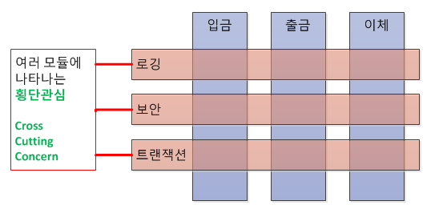

<br>

## 🤝 횡단 관심사 란?

<br>



비즈니스 로직의 핵심 기능이 아닌, 프로세스 중간에 삽입되는 기능을 말한다.<br>
위 사진처럼 프로세스마다 공통되는 기능을 `횡단 관심사`라고 부르며, 이러한 관심사들의 분리는 `AOP`, 즉 관점 지향 프로그래밍에서 모듈성을 증가시키기 위한 패터다임이다.<br>

<br>

### 🗿 AOP의 주요 개념

<br>

- Aspect : 위에서 설명한 `횡단 관심사`를 모듈화 한 것이다.
- Target : Aspect를 적용하는 곳이다.
- Advice : 실질적인 부가기능을 담은 구현체이다.
- JointPoint : `Advice가 적용될 위치`로 필드에서 값을 꺼내올 때 등 다양한 시점에 적용 가능하다.
- PointCut : `JointPoint의 상세한 스펙`을 정의한 것으로 Advice가 실행될 지점을 정할 수 있음

<br>

### 👽 NestJS의 Interceptor 란?

<br>

NestJS는 `AOP(Aspect Oriented Programing)`에서 영감을 받은 Interceptor를 다음과 같은 5가지의 예시를 들며 강조하고 있다.<br>

- 메서드 실행 전후에 추가 논리 바인딩
- 함수에서 반환된 결과를 변환
- 함수에서 throw된 예외를 변환
- 기본 기능 동작 확장
- 특정 조건에 따라 함수를 완전히 재정의 (예: 캐싱 목적)

<br>

NestJS 요청 - 응답 생명주기를 봤을 때 Controller 로직 전/후로 동작을 수행하는 기능이다.<br>
여기서 위 1번 기능으로 `JointPoint`를 지정해 관심사 분리를 진행할 예정이다.<br>

<br>

## 🪢 횡단 관심사 분리

<br>

예를들어 채팅방을 구현한다 가정을 해보자.<br>
방장이 존재할 것이며, 방장은 `mute`, `ban`, `invite`의 기능을 수행할 수 있다.<br>
유저는 `chat`, `DM`, `block`의 기능을 사용할 수 있다.<br>
그전에 일단 해당 채팅방에 참여하고 있어야 한다.<br>
이를 통해 위 AOP의 `Aspect`를 정의해 보면 `채팅방`, `채팅`으로 구분할 수 있다.<br>

<br>

`채팅방`에서는 **채팅방 존재 여부**, **방장 권한**, **채팅방 참여 가능 여부**로 나눌 수 있고, `채팅`에서는 **mute 여부**, **block 여부**로 나눌 수 있다.<br>

<br>

### 🕸 관점을 기준으로 분리해 보자

<br>

```TS
class Client extends Socket {
  hasChannel: boolean;
  isAdmin: boolean;
  isMuted: boolean;
}

// 채팅방 Interceptor
class ChannelAuthInterceptor implements NestInterceptor {

  private readonly requiredAdmin: boolean;

  constructor(param: boolean) {
    this.requiredAdmin = param;
  }

  async intercept(context: ExecutionContext, next: CallHandler): Promise<Observable<any>> {

    // Socket Gateway 기반으로 구현된 사항 입니다.
    const client: Client = context.switchToWs().getClient();

    // 1. 채팅방에 존재하지 않는 경우 Exception
    if (!client.hasChannel)
      throw new ForbiddenException();

    // 2. 방장 권한이 없는 경우 Exception
    if (!client.isAdmin && this.requiredAdmin)
      throw new ForbiddenException();
  }
}

  // 채팅 Interceptor
class ChannelMessageInterceptor implements NestInterceptor {

  async intercept(context: ExecutionContext, next: CallHandler): Promise<Observable<any>> {

    const client: Client = context.switchToWs().getClient();

    // 3. 방장에게 채팅 차단을 당한 경우 Exception
    if (client.isMuted)
      throw new ForbiddenException();
  }
}
```

<br>

위에 예시로 적은 모든 기능들을 코드화 하진 않았지만, 위와 같이 `채팅방`, `채팅`으로 관점을 Interceptor로 분리하고, 세부적인 기능을 조건문으로 조정할 수 있다.<br>

<br>

### 🎯 PointCut

<br>

클래스, 메서드 어느 곳이던 위 `Interceptor`를 적용할 수 있다.<br>
위 예시는 채팅방이니, `Gateway`의 메서드 하나에 적용해 보도록 하겠다.<br>

```TS
import ChannelAuthInterceptor from '@Interceptor/channel';

@WebSocketGateway()
export class SocketGateway implements OnGatewayConnection, OnGatewayDisconnect {

  /* ... */

  // ⬇️ 이곳이 PointCut이 된다.
  @UseInterceptors(new ChannelAuthInterceptor(true))
  @SubscribeMessage('muteUser')
  muteUser(@ConnectedSocket() client: ClientInstance, @MessageBody('userId') userId: number) {
    /* Business Logic */
  }
}
```

<br>

위처럼 필요한 메서드에 `@UseInterceptors` 데코레이터를 사용하여 `Interceptor`를 적용할 수 있다.<br>
필요에 따라, 여러 관심사들을 `Interceptor`로 묶어 `횡단 관심사 분리`를 진행할 수 있다.<br>

<br>

이로인해 AOP의 주요 목적인 `관심사`들의 모듈화를 하게 되어, 유지보수성이 높은 코드를 짤 수 있게 된다.<br>

<br>

### 🧩 Interceptor로 할 수 있는 것들

<br>

Interceptor만 잘 이용하면 여러 기능을 구현할 수 있다.<br>
HTTP 통신 라우터라면 throw 컨트롤, 메서드 로깅, 요청값 변경, 유효성 검사 등 여러 기능을 수행할 수 있다.<br>

<br>

이외에 `Socket Gateway`라면 NestJS에서 지원하지 않는 `Socket Message Body`의 유효성 검사가 가능하다.<br>
이 부분은 `ValidationPipe`로 진행할 수 있다고 생각할 수 있는데, `ValidationPipe`는 정상적으로 들어온 인자에 대해 검사를 진행하기 때문에, 애초에 `undefined`로 들어온 인자는 검사 자체를 안한다.<br>
이는 서버 운영에 치명적인 결과를 낳을 수 있지만 `Interceptor`만 잘 활용하면 해결 가능한 문제이다.<br>

<br>

## 📚 참고 자료

<br>

> NestJS Docs

- https://nestjs.com

<br>

> AOP 주요 개념

- https://engkimbs.tistory.com/746

<br>

## 🧑‍💻 Github 주소

<br>

- [이 글을 쓰게 된 계기](https://github.com/mtak0235/simmons_transcendence/blob/main/backend/node/app/src/socket/interceptor/channel.socket.interceptor.ts)

<br/>
<br/>

```toc

```
