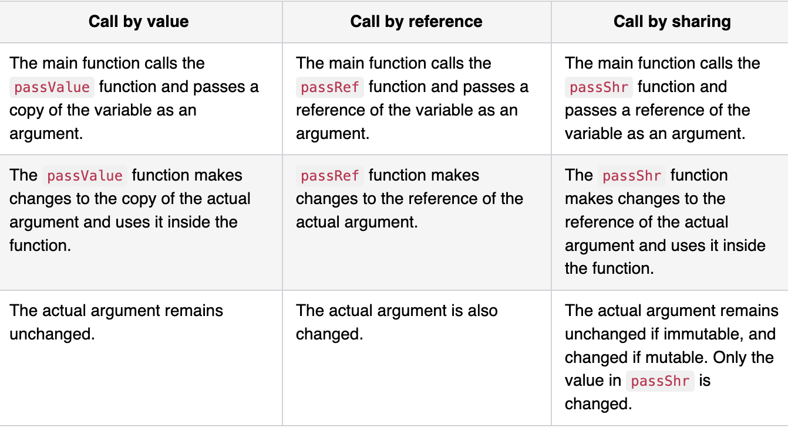

## 🌊 Session 이란?

<br>

```
반영구적이고 상호작용적인 정보 교환을 전제하는 둘 이상의 통신 장치나 컴퓨터와 사용자 간의 대화나
송수신 연결상태를 의미하는 보안적인 다이얼로그(dialogue) 및 시간대를 가리킨다.
따라서 세션은 연결상태를 유지하는 것보다 연결상태의 안정성을 더 중요시 하게 된다.
```

> [출처] [Wikipedia](<https://en.wikipedia.org/wiki/Session_(computer_science)>)

<br>

쉽게 설명하자면 웹에선 `Client`가 사이트에 접속해 어느 위치에 있는지, 어떤 상호작용을 했는지 등 `Client`의 정보를 서버에 저장해 `Stateful`한 상태를 유지하는 개념이다.<br>
세션을 쿠키와 굉장히 헷갈려 하는데, 일단 쿠키는 `Client side`에서 관리되고, 세션은 `Server side`에서 관리된다.<br>

<br>

세션은 쿠키처럼 가시적인 부분에 있는 것이 아니라 이해하기 힘든데, 서버에 파일, 메모리, DB등 어디에든 저장되어 `Client`의 상태 관리를 하는 개념이다.<br>
추상적인 개념이지만, 사용자가 사이트에 접속해 나가기 전 까지 서비스에 따라 사용자의 데이터를 서버에서 관리하는 것이다.<br>

<br>

## 🤝 Session을 유지시키는 방법

<br>

프레임워크 내부 `세션 라이브러리`를 사용하는 방법이 제일 편하고, 사용하기 쉽지만, 이번엔 다른 방법으로 세션을 구현해 보려 한다.<br>

<br>

### 💾 세션을 구현하기 위한 다양한 방법

<br>


위와 같은 게임 데이터가 있다고 가정을 해보고 세션 설계를 진행해 보자.<br>
일단 `Third-party DB`를 사용하는 방법, `서버 힙 메모리`를 이용하는 방법이 있다.<br>

<br>

서비스 요구사항에 다르겠지만, 영속성이 보장되어야 하는 서비스의 경우 `Third-party DB`를 사용하면 좋을 것 같고, 그 중 `Update`가 빈번히 일어나는 설계가 된다면 `RDB`를 이용해 구현하면 좋을 것 같다.<br>
이외의 상황이라면 `In-memory DB` 또는 `Disk-based DB`의 `noSQL`을 사용할 것 같다.

> noSQL은 데이터의 구조가 클 때, `Update`가 빈번히 일어나면 성능상 좋지 않다.

<br>

만약 영속성 보장이 필요없는 서비스거나, 빠른 개발을 목적으로 한다면 `서버 힙 메모리`에서 세션을 관리하면 좋을 듯 하다.<br>

<br>

## 📱 메모리로 세션을 유지하는 방법

<br>

`JavaScript`의 자료구조를 적절히 이용하여 세션을 유지해보자.<br>
자료구조와, `JavaScript`의 Argument 전달 전략을 적절히 섞으면, 메모리 유실 없이 `Client`의 세션을 유지시킬 수 있다. 이 때, [평가 전략](https://en.wikipedia.org/wiki/Evaluation_strategy)인 Call by sharing을 이용하고, [Hash Table](https://en.wikipedia.org/wiki/Hash_table)을 사용하는 자료구조인 [Map](https://developer.mozilla.org/en-US/docs/Web/JavaScript/Equality_comparisons_and_sameness#same-value-zero_equality)을 사용할 예정이다.<br>

<br>

### 📞 Call by sharing 이란?

<br>



> [출처] [What is call by sharing?](https://www.educative.io/answers/what-is-call-by-sharing)

<br>

자료구조를 알아보기 앞서, JavaScript의 특별한 매개변수 전달 전략에 대해 설명하려 한다.<br>
Call by sharing이란, `Strict binding strategies`에 속해있는 Call by value와 Call by reference를 섞은`평가 전략`이라고 한다.<br>
전달되는 인자 자체는 `Call by value`로 작동하지만, 인자 내부의 값은 `Call by reference`로 작동한다. 즉 전달되는 인자는 `복사`되어 전달되지만 인자가 가르키는 객체 내부의 주소는 공유가 되는 형식이다.<br>

<br>

이러한 `얕은 복사`가 일어나는 것을 명심해서 코드를 작성해야 하고, `깊은 복사`를 원한다면, 클래스의 복사생성 전략을 사용하던지, 메모리를 새로 할당해서 직접 저장하는 방식을 택해야 한다.<br>

<br>

### 🗺 Map 자료구조

<br>

`JavaScript`의 Map 자료구조는 `Hash Table` 알고리즘으로 구현되어 있다.<br>
간략히 설명해보면, key를 구현된 `Hash Function`으로 해싱을 하고, 인덱스로 활용하는 방식이다.<br>
해싱을 진행할 때 알고리즘이 제일 중요시 되며, Result가 중복되는 Index일 수 있어, `Collision`에 대해서도 잘 대응을 해야한다.<br>

<br>

해싱 알고리즘에 따라 다르지만 key 해싱이 된 후엔 평균 O(1)의 시간 복잡도를 가진다.<br>

> 해싱된 Index에 Value를 넣기만 하면 돼서 최선의 경우 O(1)이지만, 해싱된 Index의 충돌 등 최악의 경우 O(N)까지 복잡도가 커진다.

<br>

### 🤔 Hash Table의 Collision 관리

<br>

`Collision`을 해결하기 위한 여러 전략이 있는데 이 중 `Separate chaining`과 `Open Addressing`의 `Linear probing`에 대해서만 간단히 설명하겠다.<br>

<br>

> Separate chaining (분리 연결법)


동일 해싱 Index인 경우 해당 인덱스에 `Linked list` 형식으로 나열하는 충돌 관리 기법이다.<br>
bucket에 해당 key의 `해싱된 Index`가 보장될 수 있지만, 동일 인덱스 데이터가 많아질 경우 특정 데이터를 찾을 때 성능을 보장할 수 없다.<br>

<br>

> Linear probing (선형 탐색법) | Open Addressing (개방 주소법)


동일 해시 인덱스 삽입 시 `bucket의 다음 인덱스`에 데이터를 삽입하는 방법이다.<br>
하지만 `Primary clustering에 취약`하다는 단점이 있다. 이 기법 역시 데이터가 많아진다면 복잡도가 높아질 수 있다.<br>

<br>

위와 같이 `Chaining`과 `Open Address`기법을 이용한 `Hash table collision` 해결에 대해 알아보았다.<br>
Node.js의 충돌 해결 기법은 위 방식에서 어떤 방식을 사용하는지 소스코드를 뜯어봐도 찾기 힘들었지만, JavaScript의 Map 자료구조가 어떤 식으로 생겼는지 알아본 계기로만 하고, 본론으로 돌아와서, 메모리에 `Session`을 구현해보자.<br>

<br>

## 🧑‍💻 Session 구현

<br>

```TS
class BaseSessionStore<T1, T2> {
  protected store = new Map<T1, T2>();

  public get(key: T1): T2 {
    return this.store.get(key);
  }

  public set(key: T1, value: T2): void {
    this.store.set(key, value);
  }
}
```

> JavaScript의 경우 타입이 없으니 타입 지정을 빼고 구현하면 된다.

<br>

우선, `BaseSessionStore` 클래스를 제작해 주고, `Generic Type` T1, T2를 받아와 준다.

> `Generic Type`이란, 범용 타입이다. 변수 혹은 클래스 생성 시, 정해준 타입으로 컴파일 시 적용된다.

<br>

위와같은 보일러 클래스를 Domain 별로 사용하기 위해, 상속을 통해 Domain 별 세션 클래스를 제작할 수 있다.<br>

<br>

```TS
class UserSessionStore extends BaseSessionStore<number, string> {

  constructor() {
    super();
  }

  getAllUsers(): string[] {
    return [...this.store.values()];
  }
}
```

<br>

위와같이 `BaseSessionStore`를 상속받아 구현 된 `UserSessionStore`가 있다.<br>
key는 number, value는 string으로 설정하였다.<br>

<br>

### 🦿 Session Store 클래스 사용

<br>

```TS
...

module.exports = new UserSessionStore();

...

const userSessionStore = require('./userSessionStore.ts');
// or
import { userSessionStore } from './userSessionStore';
```

<br>

일단 Map 자료구조를 이용한 클래스 생성은 알겠으니, 실제 프로덕트에 적용시켜 본다면 Node.js의 `require` 또는 `import`를 사용하여 캐싱된 모듈을 불러오는 식으로 생성된 클래스를 이용할 수 있다.<br>

<br>

프레임워크에서 IOC를 지원한다면 `Dependency Injection`을 사용하여 클래스를 싱글톤으로 유지해 사용하는 방법이 있다.<br>

<br>

두 경우 객체 내부 메모리는 공유되는 `Call by sharing` 기법이 적용되어 객체 내부 데이터를 잃지 않고 유지할 수 있다.<br>
이러한 방법을 통해 `Session store`를 구현해 봤으며, 적절히 필요에 따라 사용하면 될 듯 하다.<br>

<br>

## 📚 참고 자료

> Evaluation strategies

- https://en.wikipedia.org/wiki/Evaluation_strategy

<br>

> Hash Table Algorithm

- https://en.wikipedia.org/wiki/Hash_table
- https://nlp.chonbuk.ac.kr/AL/ch06.pdf

<br/>
<br/>

```toc

```
