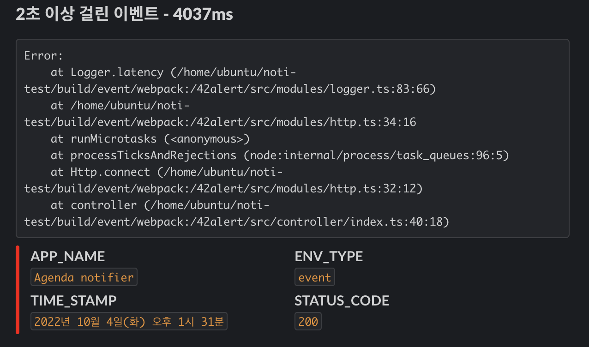

<br>

서버를 운영하다 보면, 예상치 못한 문제에 직면할 때가 많을 것이다.<br>
서버가 죽는다던지, 특정 로직에서 오류가 발생하는 등 하루종일 서버를 관찰하지 않는 이상 즉각적인 대응은 힘들 것이다.<br>
이런 `Critical한 Issue`를 대응하기 위해 Slack을 모니터링 알림으로 사용해 보고자 한다.<br>

> Slack web hook을 이용해야 해서 다음 글을 참고하면 도움이 될 듯 하다.

- [Slack Webhook API 생성하기](https://jojoldu.tistory.com/552)
- [Sending messages using Incoming Webhooks](https://api.slack.com/messaging/webhooks)

<br>

```TS
...

new Error("에러 발생!");

...
```

<br>

예시를 위해 일부러 Error를 throw 했는데, 직접 핸들링 하는 Error가 아니라 `코드 에러`, `DB 에러`, `비동기 에러` 등 당장 처리할 수 없는 Error에 대해 모니터링 프로세스를 통해 빠른 대응으로 안정적인 서비스를 운영할 수 있어야 한다.<br>

<br>

## ✍️ Error Handling

<br>

모니터링 프로세스를 놓던, 로깅을 하던 일단 에러에 대해 Handling 할 수 있어야 한다.<br>
`Framework`단에서 지원하는 Filter가 있다면 상관없지만, 싱글 스레드로 동작하는 Node.js에겐 Error Handling이 잘 이루어져야 한다.<br>

> 비동기 로직은 메인 스레드가 아닌 스레드로 돌아가기 때문에 적절한 처리가 안된다면 프로세스가 죽는다.

<br>

- [Express로 구현한 비동기 Error Handling](https://seongsu.me/skill/express-error-middleware/)

<br>

## 🤖 슬랙봇을 이용한 Error 모니터링

<br>

슬랙봇을 통해 모니터링을 하기 위해서, Error 발생 지점(trace), Error Message, Date time 등이 필요할 텐데, 여기에 마크다운을 이용한 디자인 매핑을 하게 되면, 보기 좋은 에러 알림이 될 것이다.<br>

<br>

```TS
interface Field {
  title: string;
  value: any;
  short?: boolean;
}

interface Block {
  type: string;
  text: any;
}

class SlackTextBuilder {
  color: string;
  pretext: string;
  fields: Array<Field>;
  blocks: Array<Block>;

  constructor({ color, pretext }: Partial<{ color: string; pretext: string }>) {
    this.color = color || "#2eb886";
    this.pretext = pretext || "";
    this.fields = [];
    this.blocks = [];
  }

  addField(field: Field) {
    if (field.short === undefined) {
      field.short = true;
    }
    this.fields.push(field);
    return this;
  }

  addBlock(block: any) {
    this.blocks.push(block);
    return this;
  }

  toJSON() {
    return {
      as_user: false,
      attachments: [
        {
          color: this.color,
          pretext: this.pretext,
          fields: this.fields,
        },
      ],
      blocks: this.blocks,
    };
  }
}
```

> [여기](https://api.slack.com/messaging/composing/layouts)에서 볼 수 있는데, 위 클래스의 `toJSON` 부분을 이해하는 것이 중요하다!

<br>

슬랙 포매팅을 위한 클래스를 제작해 주고, 여기에 필요한 데이터를 넣으면 될 듯하다.<br>
대략 위 코드를 설명하자면 다음과 같다.<br>

- Field: 자잘한 정보들이 병렬적으로 들어갈 부분
- Block: Layer 단위로 정보들이 수직적으로 들어갈 부분

<br>

> 슬랙 메세지 포맷에 대한 정보는 다음 사이트에서 찾아볼 수 있다.

- [Creating rich message layouts](https://api.slack.com/messaging/composing/layouts)
- [Formatting text for app surfaces](https://api.slack.com/reference/surfaces/formatting)

<br>

```TS
const errorFormat = (message: string, stack: string) => {
  const builder = new SlackTextBuilder({});
  builder
    .addField({
      title: "APP_NAME",
      value: `\`Monitering test\``,
    })
    .addField({
      title: "TIME_STAMP",
      value: `\`${new Date().toString()}\``,
    })
    .addBlock({
      type: "header",
      text: {
        type: "plain_text",
        text: message,
        emoji: true,
      },
    })
    .addBlock({
      type: "section",
      text: {
        type: "mrkdwn",
        text: `\`\`\`${stack}\`\`\``,
      },
    });
  return builder.toJSON();
};

export const slackError = async (error: IError) => {
  const body = errorFormat(error);
  await axios.post(env.slackConfig.errorUri, body);
};
```

<br>

위와 같은 방식으로 `Slack message formatter` 클래스의 인스턴스를 생성한 뒤, JSON 형태로 `Body`에 담아 앞전에 생성한 `Incoming Webhook url`에 전송하면 해당 슬랙 채널에 메세지가 전송되게 된다.<br>

<br>



위와 같은 메세지 포맷을 사용하면 다음과 같이 슬랙에 메세지가 전송될 것이다.<br>

<br>

이를 통해 Latency 측정, Error 모니터링 등 상황에 맞게 여러 방면으로 실시간 서버 모니터링이 가능하니, 활용만 잘 하면 될 듯 하다.<br>

<br>

## 📚 참고 자료

> Sending messages using Incoming Webhooks

- https://api.slack.com/messaging/webhooks

<br>

> Slack Webhook API 생성하기

- https://jojoldu.tistory.com/552

<br>
<br>

```toc

```
