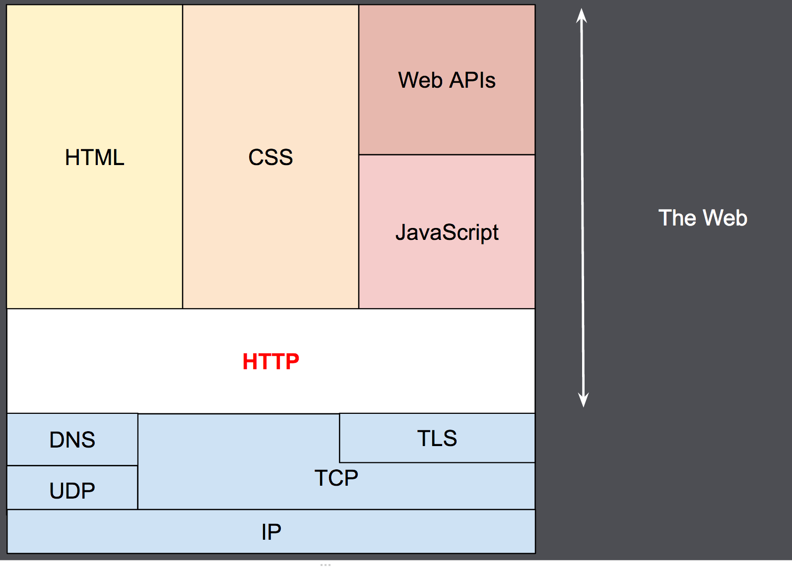
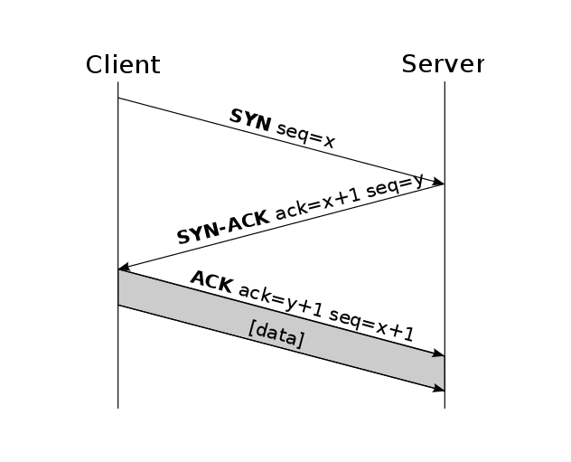
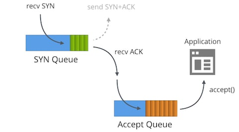
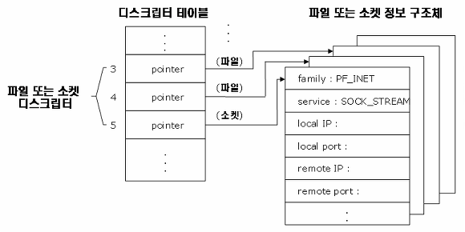
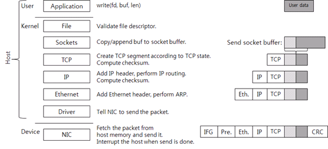
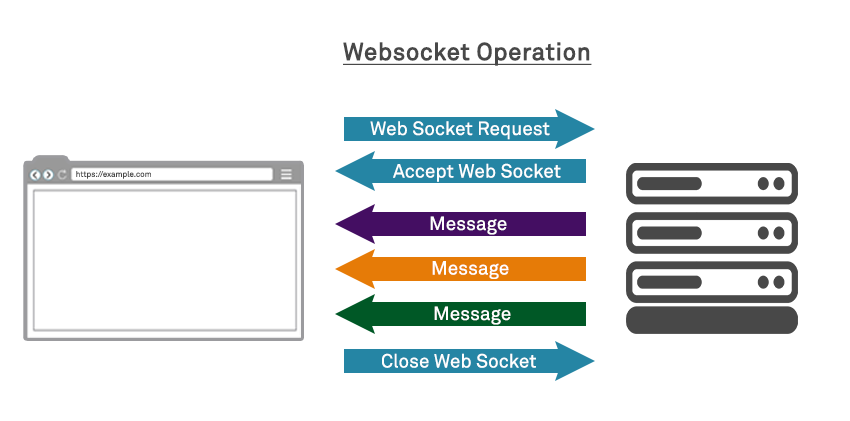

> [출처] https://korea.ul.com/ict/

<br>

## 💡 소켓 이란?

<br>

소켓은 특정한 파이프의 끝, 파이프 이음쇠 또는 위생 기구를 수용하기 위해 확장한 것으로, 또 다른 파이프의 끝이나 파이프 이음쇠을 가리킨다. 또한 소켓(socket)은 통신선 또는 전기선, 전구 따위를 끼워 넣어 연결선과 접속하게 하는 연결기구를 가리킨다.<br>

> [출처] [Wikipedia](https://ko.wikipedia.org/wiki/%EC%86%8C%EC%BC%93)

<br>

쉽게 말해, 특정 지점의 `Endpoint`를 의미하는 것이다.<br>
오늘 알아볼 내용은 `소켓` 중 `네트워크 소켓`을 알아보는 것이 목적이고, `네트워크 소켓`도 위에 설명된 소켓과 유사한 개념이다. 단지 `Endpoint`가 특정 프로세스 일 뿐이다.<br>

<br>

### 🌐 네크워크 소켓

<br>

네트워크 소켓은 네트워크를 통해 데이터를 보내고 받기 위한 `Endpoint`의 끝점 역할을 하는 `네트워크 노드` 내의 소프트웨어 구조다.<br>
소켓의 구조와 속성은 네트워크 API에 따라 정의되며, 일반적인 경우 소켓은 실행 중인 프로세스의 생명주기와 맞물린다.<br>

<br>

## 🟡 HTTP Socket

<br>



> [출처] [Mozilla HTTP](https://developer.mozilla.org/ko/docs/Web/HTTP/Overview)

<br>

우리가 매일 사용하는 HTTP 통신도 `Socket 통신`으로 작동한다.<br>
TCP/UDP 통신 위에 입혀진 HTTP는 `Socket Connection`이 된 후에 들어온 패킷의 `Payload`를 읽어내는 식으로 동작하게 정의된 규약이다.<br>

<br>

`이 글은 TCP 기반 HTTP 통신을 설명합니다.`

<br>

### 🔌 Socket Connection

<br>


[출처] https://en.wikipedia.org/wiki/Transmission_Control_Protocol

<br>

Server에 Binding된 Port로 Client가 요청을 보냈을 때 도달하는 지점이 `Server Socket` 이다.<br>

> 위 그림의 `SYN`이라 보면 된다.

그 뒤 Client 정보를 accept 해주고, Client에 `SYN-ACK` 응답이 내려간다.<br>
이렇게 소켓을 이용해 Client - Server 간 파이프라인이 구축되는 것이다.<br>

<br>

이러한 연결이 수립되면, Client와 Server는 `HTML`, `CSS`, `JS`, `JSON`, `Binary` 등과 같은 데이터를 주고 받을 수 있다.<br>

<br>

### ❗️ Client가 SYN만 보내고 끝내면 어떻게 되지?

<br>



> [출처] https://blog.cloudflare.com/ko-kr/syn-packet-handling-in-the-wild-ko-kr/

<br>

Client가 `SYN`만 보내고 `ACK`를 Server에 보내지 않으면, Server의 `Backlog Queue`에 담겨있는 Client 정보가 계속 남게 된다.<br>
그 때 Server는 리눅스 기준 5번까지 `SYN-ACK`요청을 다시 보내고 응답이 없으면 `Timeout`처리를 하게 된다.<br>

> 서버 소켓 설정에 따라 다르겠지만, Backlog Queue가 다 찬 경우, 새로운 Client의 연결 요청은 [SYN Cookie](https://lwn.net/Articles/277146/)형식으로 대체된다고 한다.

> [여기](https://blog.cloudflare.com/ko-kr/syn-packet-handling-in-the-wild-ko-kr/)에서 **SYN 패킷 처리 방법**을 보는 것을 정말 추천한다. 설명이 너무 잘되어 있다.

<br>

### 🚪 Client가 Server에 연결되는 방법

<br>



> [출처] https://luckyyowu.tistory.com/71

<br>

Client가 최초 `SYN` 요청을 보냈을 때, Server 커널에 Client 정보가 담긴 `Payload`가 들어온다.<br>
Server는 Socket으로 Binding된 fd를 통해 [**poll()**](https://man7.org/linux/man-pages/man2/poll.2.html)을 사용하여 지속적으로 커널을 읽어와, Client의 정보를 `Application Layer`로 불러와 [**accept()**](https://man7.org/linux/man-pages/man2/accept.2.html)하는 과정을 거친다.<br>

> [**poll()**](https://man7.org/linux/man-pages/man2/poll.2.html) 뿐 아니라, [**select()**](https://man7.org/linux/man-pages/man2/select.2.html), [**kqueue()**](https://sjmulder.nl/dl/pdf/unsorted/2000%20-%20Lemon%20-%20Kqueue,%20A%20generic%20and%20scalable%20event%20notification%20facility.pdf) 등 여러 시스템 콜 함수도 있다.

> 이 때, Server에서 Client로 `SYN-ACK` 요청이 가게 된다.

<br>

[**accept()**](https://man7.org/linux/man-pages/man2/accept.2.html)가 끝났다면, HTTP 통신을 위해 `Client Disconnected`가 될때 까지 Client의 정보를 커널에 저장한다.<br>
이러한 `프로세스 커널`을 이용한 연결 수립 과정을 통해 Client - Server간 통신이 가능한 것이다.<br>

<br>

### 🌊 HTTP Packet 전송 방식

<br>



> [출처] (https://d2.naver.com/helloworld/47667)

<br>

우선 NIC가 들어온 패킷을 자신의 메모리에 기록하고, CRC검사로 패킷이 유효한지 확인한 뒤 호스트의 메모리 버퍼로 이동시킨다.<br>
이 버퍼는 드라이버가 커널에 요청하여 `패킷 수신용으로 미리 할당한 메모리`이고, 할당을 받은 후 드라이버는 NIC에 메모리 주소와 크기를 알려 준다.<br>

> NIC가 패킷을 받았는데, 드라이버가 미리 할당해 놓은 호스트 메모리 버퍼가 없으면 NIC가 패킷을 버릴 수 있다 (packet drop).

<br>

그 뒤 제조사 별 정의된 Driver 통신 규약에 따라 상위 Layer로 패킷을 전송하고, Ethernet에선 헤더를 제거한 패킷을 상위 Layer로 전달한다.<br>

<br>

IP Layer에선 목적 ip에 대한 라우팅을 진행한다.<br>

> ip가 현재 장비인지 다른 장비인지 확인한다.

<br>

`IP, TCP Layer`를 통과했다면, 패킷은 목적 Port와 매핑된 프로세스의 커널에 저장될 것이다.<br>
이때 Server 프로세스에서 커널 버퍼를 읽는 과정을 진행하고, `Application Layer`로 데이터를 전송한다.<br>

<br>

이제 Server에서 HTTP에 정의된 내용으로 header와 body를 읽어 그에 맞는 `Business Logic`이 실행된 뒤 적절한 응답이 내려간다.<br>

> HTTP에 대한 내용은 [RFC-7230](https://www.rfc-editor.org/rfc/rfc7230) 문서를 보면 잘 설명 되어있다.

<br>

## 🔵 Web Socket

<br>


> [출처] https://geekflare.com/websocket-servers

<br>

Web Socket은 위 TCP 접속에 [전이중 통신](https://ko.wikipedia.org/wiki/%EC%9D%B4%EC%A4%91%ED%86%B5%EC%8B%A0)을 지원하는 통신 프로토콜이다.<br>

<br>

Web Socket은 `HTTP 통신과 같은 반이중 방식`보다 오버헤드가 낮은 웹 브라우저와 웹 서버 간의 상호 작용을 가능하게 하여 서버에서 `실시간 데이터 전송`을 용이하게 한다.<br>

이것은 Client와 Server간에 연결 수립을 하지 않고 `Payload만 전송`할 수 있다는 것을 의미한다.<br>

HTTP에서 억지로 양방향 통신을 구현한 것이고, `Observer` 패턴과 비슷하다고 볼 수 있지만, 서로 `Request`를 계속 보내는 형식이다.<br>

<br>

### 🤝 Web Socket 연결 수립 과정

<br>

> Client Handshake Request

```
GET /change/protocol HTTP/1.1

Host: server.example.com
Upgrade: websocket
Connection: Upgrade
Sec-WebSocket-Key: dGhlIHNhbXBsZSBub25jZQ==
Origin: http://example.com
Sec-WebSocket-Protocol: chat, superchat
Sec-WebSocket-Version: 13
```

<br>

> Server Handshake Response

```
HTTP/1.1 101 Switching Protocols

Upgrade: websocket
Connection: Upgrade
Sec-WebSocket-Accept: s3pPLMBiTxaQ9kYGzzhZRbK+xOo=
Sec-WebSocket-Protocol: chat
```

<br>

우선 HTTP 연결이 우선이 되어야 하고, Client에서 Server에 Web Socket으로 프로토콜을 변경한다는 요청을 보낸다.<br>

그 뒤 Server에서 Client로 프로토콜이 변경됐다는 응답을 보낸다.<br>

이제, 각 프로세스에서 HTTP가 아닌, WS 프로토콜로 통신을 하게 되는 것이다.<br>

<br>

### 💿 Web Socket 데이터 전송 방식

<br>



<br>

Web Socket은 데이터를 `Frame`으로 구성하고, 데이터를 보내기 위해 여러 종류의 Frame을 정의해놨다.<br>

- `Text frame`: 서로에게 보내는 텍스트 데이터이다.
- `Binary data frame`: 서로에게 보내는 바이너리 데이터이다.
- `ping/pong frame`: 서버에서 전송된 연결을 확인하는데 사용되며, 브라우저는 이에 자동으로 응답한다.
- `connect/close frame`: 연결/종료에 대한 프레임 데이터이다.

<br>

> Web Socket의 경우 `Frame`을 받는 버퍼가 다 찬 경우와 건너편 소켓이 `Close` 상태인 경우 소켓이 닫히게 된다.

<br>

## 📚 참고 자료

<br>

> Network Socket

- https://en.wikipedia.org/wiki/Network_socket

> HTTP 개요

- https://developer.mozilla.org/ko/docs/Web/HTTP/Overview

> TCP/IP 네트워크 스택 이해하기

- https://d2.naver.com/helloworld/47667

> SYN 패킷 처리

- https://blog.cloudflare.com/ko-kr/syn-packet-handling-in-the-wild-ko-kr/

> A Simple Explanation Of What A WebSocket Is

- https://www.wallarm.com/what/a-simple-explanation-of-what-a-websocket-is

<br>
<br>

```toc

```
